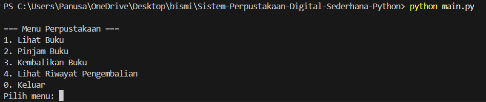
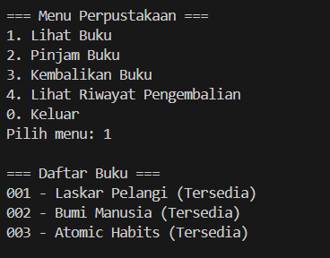
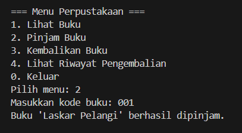
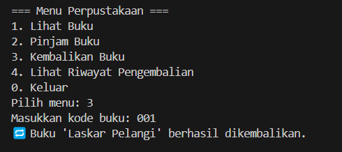
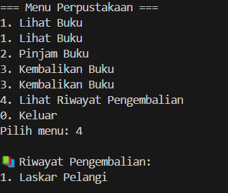
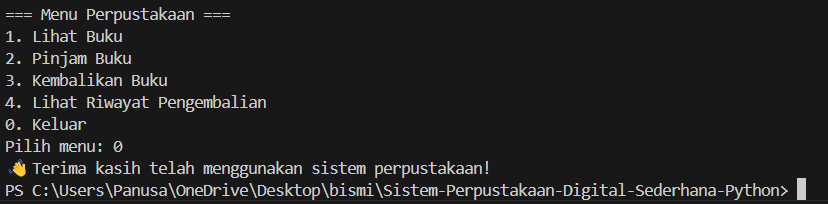

# Sistem-Perpustakaan-Digital-Sederhana-Python

## 1. PENDAHULUAN


### 1.1 Tujuan
Dokumen ini bertujuan untuk memberikan deskripsi lengkap mengenai spesifikasi kebutuhan sistem **Peminjaman Buku Sederhana**. Sistem ini dikembangkan untuk memberikan solusi ringan dan efisien bagi proses peminjaman dan pengembalian buku tanpa membutuhkan database atau antarmuka grafis (GUI). Sistem dijalankan melalui Command Line Interface (CLI) dan ditujukan untuk kebutuhan edukatif, simulasi, maupun penggunaan lokal.


### 1.2 Lingkup Sistem
Sistem ini mencakup fitur-fitur dasar:
- Menampilkan daftar buku beserta status ketersediaannya
- Melakukan proses peminjaman buku jika tersedia
- Mengembalikan buku yang telah dipinjam
- Menampilkan riwayat pengembalian buku selama sesi aktif


> ⚠️ Catatan: Sistem tidak menyimpan data secara permanen. Semua proses berlangsung selama runtime aplikasi.


### 1.3 Definisi, Akronim, dan Singkatan


| Istilah  | Definisi                                      |
|----------|-----------------------------------------------|
| CLI      | Command Line Interface                        |
| Python   | Bahasa pemrograman tingkat tinggi             |
| SRS      | Software Requirements Specification           |
| Runtime  | Periode saat program berjalan aktif           |
| User     | Pengguna sistem (peminjam/kasir)              |


---

## 2. DESKRIPSI UMUM


### 2.1 Perspektif Produk
Produk ini bersifat **standalone** (mandiri) dan **non-database**, semua data hanya ada selama runtime. Ditulis seluruhnya dalam Python tanpa pustaka eksternal — ringan, portabel, dan mudah digunakan.


### 2.2 Fungsi Umum Sistem
- Menyajikan daftar buku kepada pengguna
- Mengelola status buku (tersedia/dipinjam)
- Merekam riwayat pengembalian buku
- Navigasi dengan menu numerik sederhana


### 2.3 Karakteristik Pengguna
Pengguna hanya perlu kemampuan dasar menggunakan terminal. Tidak diperlukan keahlian teknis lanjut.


---

## 3. KEBUTUHAN FUNGSIONAL


| Kode   | Nama Fitur       | Deskripsi Fungsi                                                |
|--------|------------------|------------------------------------------------------------------|
| RF001  | Tampilkan Buku   | Menampilkan daftar buku dan status (Tersedia/Dipinjam)          |
| RF002  | Pinjam Buku      | Pengguna dapat meminjam buku jika tersedia                      |
| RF003  | Kembalikan Buku  | Pengguna dapat mengembalikan buku yang dipinjam                 |
| RF004  | Lihat Riwayat    | Menampilkan daftar buku yang dikembalikan selama sesi aktif     |
| RF005  | Validasi Input   | Verifikasi kode buku dan status ketersediaan sebelum proses     |


---


## 4. KEBUTUHAN NON-FUNGSIONAL


| Kode     | Keterangan                                                                 |
|----------|----------------------------------------------------------------------------|
| RNF001   | Respon sistem diberikan dalam waktu < 1 detik                              |
| RNF002   | Berjalan pada Python 3.x tanpa pustaka eksternal                           |
| RNF003   | Antarmuka berbasis teks (CLI)                                              |
| RNF004   | Cross-platform (Windows, Linux, macOS)                                     |
| RNF005   | Data bersifat sementara dan tidak disimpan secara permanen                |


---

## 5. ANTARMUKA SISTEM


### 5.1 Antarmuka Pengguna
- Teks terminal (CLI)
- Pilihan menu numerik
- Masukan kode buku string (contoh: `"001"`)


### 5.2 Antarmuka Perangkat Keras
- Komputer/Laptop dengan RAM minimal 1 GB
- Python 3.x terinstal
- Tidak memerlukan perangkat keras tambahan


### 5.3 Antarmuka Perangkat Lunak
- Python Interpreter 3.x
- Tidak menggunakan pustaka eksternal seperti `requests`, `pandas`, dll.


---


## 6. BATASAN SISTEM
- Tidak menyimpan data antar sesi (data hilang setelah keluar)
- Tidak mendukung multi-user atau sistem login
- Tidak mendukung peran admin/pustakawan
- Hanya CLI, tidak tersedia GUI atau Web
- Validasi hanya pada kode buku dan status ketersediaan


---
## 7. LAMPIRAN


### 7.1 Struktur Direktori 📁
```bash
.📂
├── books.py          # Data dan fungsi untuk menampilkan buku
├── borrow.py         # Fungsi untuk meminjam buku
├── returnbook.py     # Fungsi untuk mengembalikan buku dan melihat riwayat
├── main.py           # Antarmuka pengguna dan menu utama
└── README.md         # Dokumentasi proyek ini
```
---

### 7.2 Preview Tampilan Program 📸
#### Menu 📚

#### Lihat Buku 📖

#### Pinjam Buku 📗

#### Kembalikan Buku 📕

#### Lihat Riwayat Pengembalian 📝

#### Keluar🚪

---

## 👨‍💻 Kontributor
### Kelompok 1
1. Ariq Mahira Chandra (2310511009)
2. Muhammad Evan Althafy Marhian (2310511003)
3. Rangga Novbrian Syawal Putra Ananto (2310511004)
4. Pandu Nugraha Saputra (2310511009)
Mahasiswa Informatika – UPN Veteran Jakarta


